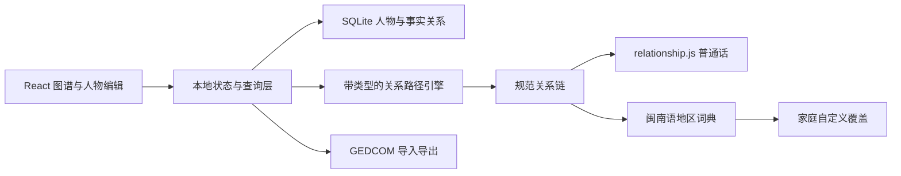

# 亲戚关系图：开源项目实测与技术决策

更新日期：2026-07-12

## 结论

不直接 fork 任一完整产品。第一版采用“自主数据模型 + 复用中文称呼引擎 + 借鉴成熟图谱交互”的组合路线：

- 使用 `mumuy/relationship` 作为普通话亲属称呼解析器；
- 自己实现人物图谱、关系路径搜索和主视角状态；
- 参考 Topola Viewer 的关系图布局、GEDCOM转换、导出和重新聚焦交互；
- 只把 `qiaoshouqing/familytree` 当作中文族谱展示参考，不采用其数据模型；
- 闽南语称呼建立独立、可分地区覆盖、可由家庭自定义的词典层。

这样可以保留 MIT/Apache-2.0 组件的复用空间，避免被完整族谱系统的技术栈和强 copyleft 许可证绑定。

## 实测环境与结果

候选项目均以 shallow clone 放在 `/tmp/relation-open-source-review`，没有复制进本仓库。

| 项目 | 实测提交 | 结果 | 维护/供应链观察 |
| --- | --- | --- | --- |
| `mumuy/relationship` | `4987c3f`，2026-06-11 | `npm test`：54/54通过 | 当前包版本1.2.9；MIT；没有运行时依赖 |
| `PeWu/topola-viewer` | `689f9f2`，2026-07-06 | `npm run build`通过 | TypeScript/React；Apache-2.0；依赖较多，构建主包约1.3 MB |
| `qiaoshouqing/familytree` | `aa2daeb`，2026-07-02 | 安装阶段失败 | 锁文件中的若干 `npmmirror.com` 包校验不一致；源码问题尚未进入编译阶段 |

第三项失败不说明应用代码不可用，但说明直接作为产品底座会继承额外的依赖维护工作。其数据模型限制比本次安装问题更关键。

## 候选项目源码级评价

### 1. mumuy/relationship：可以直接集成的称呼内核

它已经解决：

- 中文关系链解析；
- 正向与逆向称呼；
- 双方之间的相对称呼；
- 哥/弟、姐/妹等长幼修饰；
- 最短关系；
- 地区模式覆盖；
- 称呼、关系链、关系合称三种输出。

其输入本质是规范关系路径，例如：

```text
m,lb,d
母亲 → 弟弟 → 女儿
```

我们的应用需要在它前面增加一个适配层：

```text
真实人物图
  → 搜索主视角到目标人物的路径
  → 把人物边转换为 f/m/h/w/s/d/ob/lb/os/ls
  → relationship.js 生成普通话称呼
```

不应修改它的默认词库来塞入闽南语。应通过它的 `setMode` 思路建立独立方言包，避免普通话规则、方言词汇和家庭叫法互相污染。

### 2. Topola Viewer：借交互和算法，不整体嵌入

源码确认 Topola 的选中人物变化会触发图表重新渲染和位置重置。它还具有可直接参考的能力：

- 父母、配偶、子女的GEDCOM模型；
- 查找两个人之间的关系路径；
- 获取祖先与后代；
- 点击人物聚焦；
- 详情侧栏；
- 搜索索引；
- PNG/SVG/PDF导出；
- GEDCOM/GEDZIP导入；
- 大文件在浏览器内存中的处理策略。

但它的 `focus` 主要负责选择人物、重构显示范围和移动视口，并不会生成中文文化称谓。它的UI依赖 Semantic UI，整体样式和包体也不适合直接成为新产品外壳。

推荐复用方式：

- 研究或单独采用底层 `topola` / `family-chart` 布局库；
- 参考其 GEDCOM 转换测试；
- 参考 `findRelationshipPath`，但为称谓推导编写自己的带边类型路径搜索；
- 不复制整个 Topola Viewer 页面结构。

### 3. qiaoshouqing/familytree：只作为中文展示参考

源码中的核心关系只有 `fatherId`。配偶是字符串字段，母亲不是正式关系边；树构建代码甚至把所有具有 `fatherId` 的人物统一放入父亲的“sons”集合。

因此它无法成为以下功能的可靠底座：

- 母系亲属；
- 女性后代和完整性别语义；
- 多段婚姻；
- 收养、继亲；
- 姻亲推导；
- 任意人物主视角；
- 普通话和闽南语称谓重算。

可参考内容只限于中文名字、世代分栏、族谱叙事感和轻量部署方式。

## 产品界面方向

### 领域

族谱、支系、辈分、血亲、姻亲、长幼、家族口述、地域方言。

### 色彩世界

宣纸米白、旧照片棕、木版墨黑、朱砂印色、祠堂木色、族谱线稿灰。颜色用于主视角、关系类别和证据状态，不用于装饰。

### 标志性交互

在自由画布中双击人物后，他成为图谱中心；所有人物卡片的关系、普通话称呼、闽南语称呼和路径说明同时刷新，并始终提供“回到我”。

### 拒绝的默认方案

- 普通后台侧栏 → 以可探索的家族图谱为主画布；
- 每人一个静态关系标签 → 标签随主视角动态重算；
- 单一方言下拉框 → 地区词典、家庭覆盖、录音证据三级体系；
- 只有结果没有解释 → 每个称呼都能展开查看关系路径和推导依据。

## 推荐架构



### 数据边只存事实

建议关系表只存稳定事实：

```text
parent_of
spouse_of
adoptive_parent_of
step_parent_of
```

`父亲`、`母亲`可以由 `parent_of + 人物性别`生成；哥哥、叔叔、舅舅、表姐等全部由图路径推导，不写死在人物记录里。

关系边还需要：

- 生效/结束日期；
- 亲生、收养、继亲类型；
- 信息来源；
- 确认状态；
- 家庭内部备注。

## 第一版验证范围

用一套虚拟的四代、约25人数据验证：

1. 父系、母系和配偶家族；
2. 哥弟、姐妹的长幼判断；
3. 伯叔、姑姨、舅、堂表亲；
4. 主视角在至少8个人之间切换；
5. 普通话称呼、逆向称呼和关系路径；
6. 一套泉州或厦门闽南语词典；
7. 家庭自定义称呼覆盖；
8. 信息不足时返回候选称呼，不猜测唯一答案。

## 下一实施阶段

不再继续寻找一个“全包式”开源项目。下一步应直接建立最小技术原型：

1. 初始化 Tauri + React + TypeScript；
2. 建立人物、事实关系和称呼词典模型；
3. 写关系路径到 `relationship.js` 编码的适配器；
4. 用25人虚拟家族数据建立自动化测试；
5. 实现主视角切换和三栏图谱界面；
6. 再决定采用 Topola 底层布局还是更轻的 React Flow/自研布局。

原型选择图谱库时，必须用同一份25人数据比较：配偶布局、多婚姻、交叉支系、移动端可读性和切换主视角后的动画稳定性，而不能仅根据演示截图决定。
